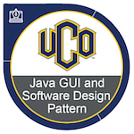
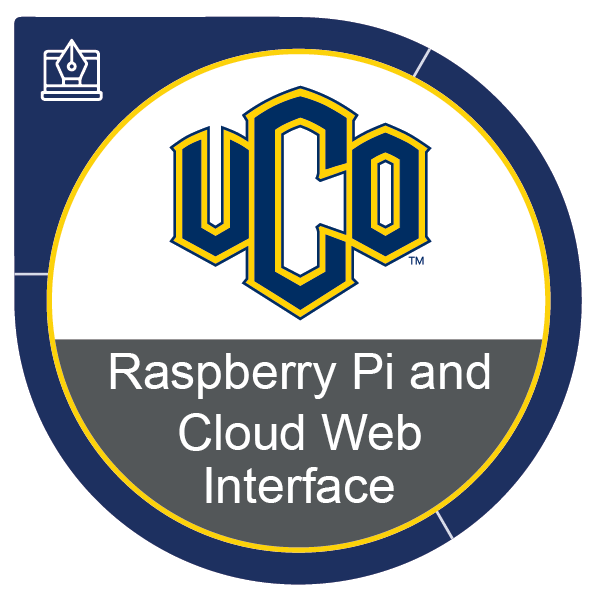

## Howdy Folks! 👋
Hello my name is Payton Kerby and I am a software developer located in small town Okarche, Oklahoma. I have graduated from Redlands Community College in December of 2023. I am now currently attending the University of Central Oklahoma majoring in Software Engineering.

## What do I know?
I have been coding for roughly 5 years now, and I find myself coding more backend related software than frontend. I love to explore and try new languages and technologies to keep myself busy.

## My Certifications

  
  
  

